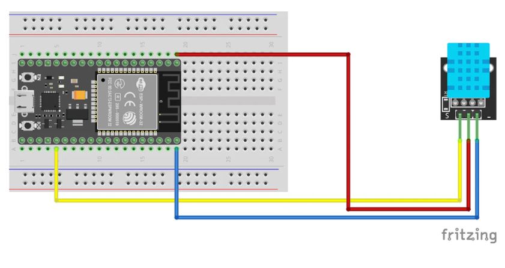

# Monitor de Temperatura y Humedad con MicroPython y Microdot

Este proyecto implementa un monitor web de temperatura y humedad utilizando un ESP32 (o microcontrolador compatible con MicroPython), un sensor DHT11, y el micro-framework web Microdot. La interfaz web, con tema oscuro y graficas en tiempo real, permite visualizar los datos del sensor de forma sencilla y sin necesidad de librerias externas de graficacion ni conexion a internet para su operacion.

## Caracteristicas

* Lectura de temperatura y humedad desde sensor DHT11.
* Servidor web ligero implementado con Microdot.
* Interfaz web responsiva con tema oscuro.
* Dos graficas separadas (Canvas HTML/JavaScript) para temperatura (amarilla) y humedad (azul).
* Actualizacion automatica de datos cada 5 segundos.
* No requiere conexion a internet para mostrar graficas (dibujo en cliente).
* Desarrollado en MicroPython para dispositivos embebidos.

## Componentes Necesarios

* **ESP32** (o cualquier microcontrolador compatible con MicroPython).
* **Sensor DHT11** (o DHT22 con ligeras modificaciones en el codigo).
* **Cables de conexion**.

## Diagrama de Conexiones

Conecta el sensor DHT11 al ESP32 de la siguiente manera:

* **VCC:** Conectar a 3.3V o 5V del ESP32.
* **GND:** Conectar a GND del ESP32.
* **DATA:** Conectar a un pin GPIO digital del ESP32 (por ejemplo, **GPIO 4**, como se usa en el codigo).

### Captura de la Conexion

_Nota: Asegurate de que el pin DATA del DHT11 este conectado al GPIO 4 (o al pin que configures en `main.py`)._

## Instalacion y Configuracion

Sigue estos pasos para poner en marcha el monitor:

### 1. Flashear MicroPython en tu ESP32

Si aun no tienes MicroPython en tu ESP32, sigue la guia oficial: [Documentacion de MicroPython para ESP32](https://docs.micropython.org/en/latest/esp32/tutorial/intro.html)

### 2. Instalar Librerias

Necesitaras las siguientes librerias en tu ESP32. Puedes subirlas manualmente o usando herramientas  `thonny`:

* **Microdot**: El micro-framework web.
    #crea la carpeta "lib" en el esp32.
    #dentro de la carpte lib crea una segunda carpeta con el nombre "microdot"
        #dento de la carpeta microdot agrega uno a uno cada elemento de la carpeta con el mismo nombre de este repositorio.
    #regresa a dentro de la carpeta "lib" y pega el archivo dht.py
    
* **dht**: Libreria para el sensor DHT. Se ha incluido una version basica de esta libreria en este proyecto (`dht.py`).

### 3. Cargar Archivos al ESP32

Sube los siguientes archivos a la raiz de tu microcontrolador. 

* `lib`
    *-- `microdot`
    *------ `init, asgi, asycio, etc etc`
    *-- `dht.py`
* `main.py`
* `index.html`

(images/CapIDE.png)
(images/APItempHum.png)
(images/TempHumPC.png)
(images/APItempTablet.jpg)

Temas relacionados
[Video : Descargar e instalar Thonny y firmware para ESP32](https://www.youtube.com/watch?v=3Yl2hgGaKy0&ab_channel=Ing.RMHG)
* Incluye el codigo de ejemplo de blink para hacer pruebas

[Video : Manejando el DHT11 con ESP32 en Micropytho](https://www.youtube.com/watch?v=k0yW6oyLC7I&ab_channel=CreatividadAhora)